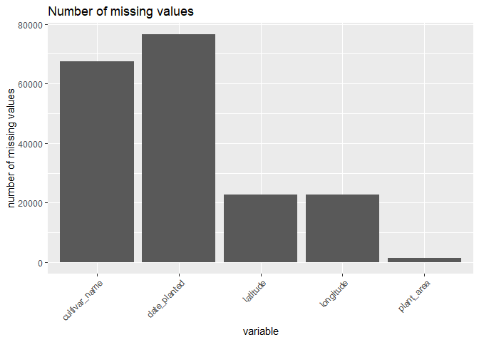
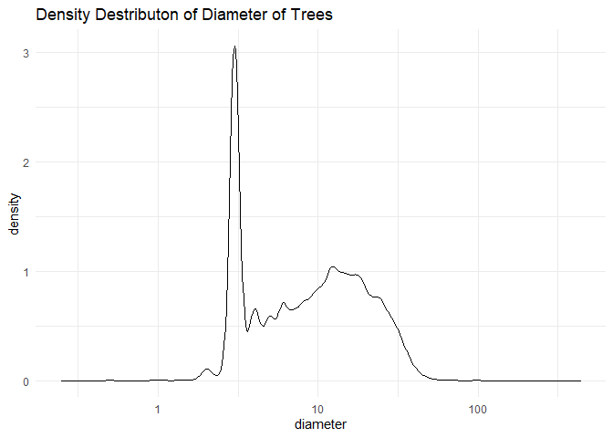
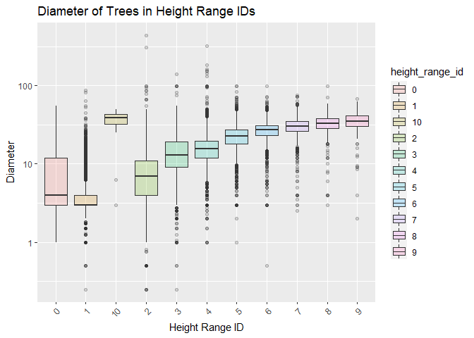
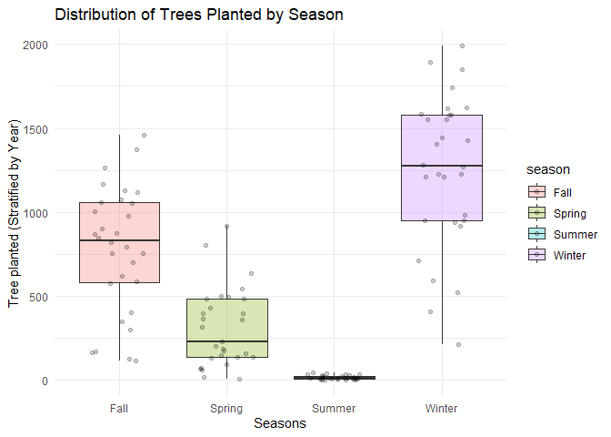
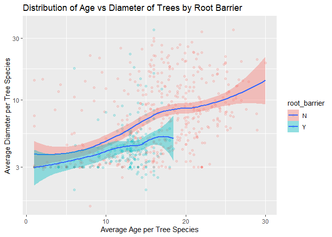
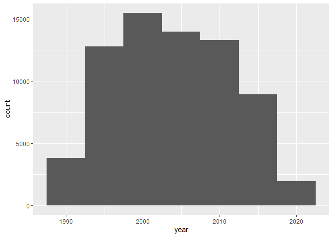
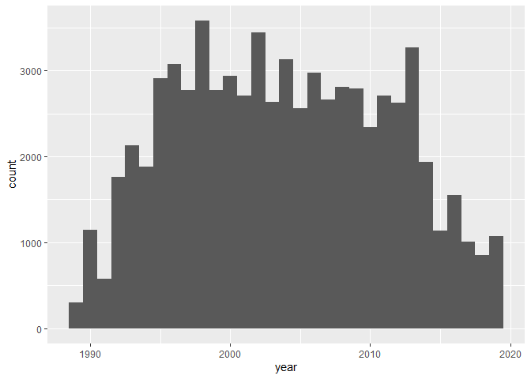
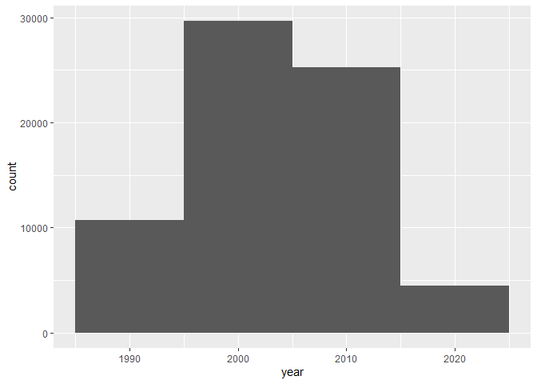

Mini Data-Analysis Deliverable 1
================

# Welcome to your (maybe) first-ever data analysis project!

And hopefully the first of many. Let’s get started:

1.  Install the [`datateachr`](https://github.com/UBC-MDS/datateachr)
    package by typing the following into your **R terminal**:

<!-- -->

    install.packages("devtools")
    devtools::install_github("UBC-MDS/datateachr")

2.  Load the packages below.

``` r
library(datateachr)
library(tidyverse)
```

    ## Warning: package 'tidyverse' was built under R version 4.1.3

    ## -- Attaching packages --------------------------------------- tidyverse 1.3.2 --
    ## v ggplot2 3.3.6      v purrr   0.3.4 
    ## v tibble  3.1.8      v dplyr   1.0.10
    ## v tidyr   1.2.0      v stringr 1.4.0 
    ## v readr   2.1.3      v forcats 0.5.2

    ## Warning: package 'ggplot2' was built under R version 4.1.3

    ## Warning: package 'tibble' was built under R version 4.1.3

    ## Warning: package 'tidyr' was built under R version 4.1.3

    ## Warning: package 'readr' was built under R version 4.1.3

    ## Warning: package 'purrr' was built under R version 4.1.3

    ## Warning: package 'dplyr' was built under R version 4.1.3

    ## Warning: package 'stringr' was built under R version 4.1.3

    ## Warning: package 'forcats' was built under R version 4.1.3

    ## -- Conflicts ------------------------------------------ tidyverse_conflicts() --
    ## x dplyr::filter() masks stats::filter()
    ## x dplyr::lag()    masks stats::lag()

3.  Make a repository in the <https://github.com/stat545ubc-2022>
    Organization. You will be working with this repository for the
    entire data analysis project. You can either make it public, or make
    it private and add the TA’s and Lucy as collaborators. A link to
    help you create a private repository is available on the
    \#collaborative-project Slack channel.

# Instructions

## For Both Milestones

-   Each milestone is worth 45 points. The number of points allocated to
    each task will be annotated within each deliverable. Tasks that are
    more challenging will often be allocated more points.

-   10 points will be allocated to the reproducibility, cleanliness, and
    coherence of the overall analysis. While the two milestones will be
    submitted as independent deliverables, the analysis itself is a
    continuum - think of it as two chapters to a story. Each chapter, or
    in this case, portion of your analysis, should be easily followed
    through by someone unfamiliar with the content.
    [Here](https://swcarpentry.github.io/r-novice-inflammation/06-best-practices-R/)
    is a good resource for what constitutes “good code”. Learning good
    coding practices early in your career will save you hassle later on!

## For Milestone 1

**To complete this milestone**, edit [this very `.Rmd`
file](https://raw.githubusercontent.com/UBC-STAT/stat545.stat.ubc.ca/master/content/mini-project/mini-project-1.Rmd)
directly. Fill in the sections that are tagged with
`<!--- start your work below --->`.

**To submit this milestone**, make sure to knit this `.Rmd` file to an
`.md` file by changing the YAML output settings from
`output: html_document` to `output: github_document`. Commit and push
all of your work to the mini-analysis GitHub repository you made
earlier, and tag a release on GitHub. Then, submit a link to your tagged
release on canvas.

**Points**: This milestone is worth 45 points: 43 for your analysis, 1
point for having your Milestone 1 document knit error-free, and 1 point
for tagging your release on Github.

# Learning Objectives

By the end of this milestone, you should:

-   Become familiar with your dataset of choosing
-   Select 4 questions that you would like to answer with your data
-   Generate a reproducible and clear report using R Markdown
-   Become familiar with manipulating and summarizing your data in
    tibbles using `dplyr`, with a research question in mind.

# Task 1: Choose your favorite dataset (10 points)

The `datateachr` package by Hayley Boyce and Jordan Bourak currently
composed of 7 semi-tidy datasets for educational purposes. Here is a
brief description of each dataset:

-   *apt_buildings*: Acquired courtesy of The City of Toronto’s Open
    Data Portal. It currently has 3455 rows and 37 columns.

-   *building_permits*: Acquired courtesy of The City of Vancouver’s
    Open Data Portal. It currently has 20680 rows and 14 columns.

-   *cancer_sample*: Acquired courtesy of UCI Machine Learning
    Repository. It currently has 569 rows and 32 columns.

-   *flow_sample*: Acquired courtesy of The Government of Canada’s
    Historical Hydrometric Database. It currently has 218 rows and 7
    columns.

-   *parking_meters*: Acquired courtesy of The City of Vancouver’s Open
    Data Portal. It currently has 10032 rows and 22 columns.

-   *steam_games*: Acquired courtesy of Kaggle. It currently has 40833
    rows and 21 columns.

-   *vancouver_trees*: Acquired courtesy of The City of Vancouver’s Open
    Data Portal. It currently has 146611 rows and 20 columns.

**Things to keep in mind**

-   We hope that this project will serve as practice for carrying out
    your own *independent* data analysis. Remember to comment your code,
    be explicit about what you are doing, and write notes in this
    markdown document when you feel that context is required. As you
    advance in the project, prompts and hints to do this will be
    diminished - it’ll be up to you!

-   Before choosing a dataset, you should always keep in mind **your
    goal**, or in other ways, *what you wish to achieve with this data*.
    This mini data-analysis project focuses on *data wrangling*,
    *tidying*, and *visualization*. In short, it’s a way for you to get
    your feet wet with exploring data on your own.

And that is exactly the first thing that you will do!

1.1 Out of the 7 datasets available in the `datateachr` package, choose
**4** that appeal to you based on their description. Write your choices
below:

**Note**: We encourage you to use the ones in the `datateachr` package,
but if you have a dataset that you’d really like to use, you can include
it here. But, please check with a member of the teaching team to see
whether the dataset is of appropriate complexity. Also, include a
**brief** description of the dataset here to help the teaching team
understand your data.

<!-------------------------- Start your work below ---------------------------->

1: CHOICE_1\_cancer_sample  
2: CHOICE_2\_building_permits  
3: CHOICE_3\_parking_meters  
4: CHOICE_4\_vancouver_trees

<!----------------------------------------------------------------------------->

1.2 One way to narrowing down your selection is to *explore* the
datasets. Use your knowledge of dplyr to find out at least *3*
attributes about each of these datasets (an attribute is something such
as number of rows, variables, class type…). The goal here is to have an
idea of *what the data looks like*.

*Hint:* This is one of those times when you should think about the
cleanliness of your analysis. I added a single code chunk for you below,
but do you want to use more than one? Would you like to write more
comments outside of the code chunk?

<!-------------------------- Start your work below ---------------------------->

***1.2 Answer:***

“steam_games” is the code chunk that was added here by the instructor.
This code shows multiple rows which would make the code messy. I have
replaced this with head() code which would give us a look at the data
but would not overwhelm, only showing the type of the dataset,
dimensions, and first 6 rows. We also have the option of going with
dim() for finding out the dimensions of the dataset, and glimpse() for a
more focused look at the observasions.

``` r
### EXPLORE HERE ###
head(cancer_sample)
```

    ## # A tibble: 6 x 32
    ##       ID diagn~1 radiu~2 textu~3 perim~4 area_~5 smoot~6 compa~7 conca~8 conca~9
    ##    <dbl> <chr>     <dbl>   <dbl>   <dbl>   <dbl>   <dbl>   <dbl>   <dbl>   <dbl>
    ## 1 8.42e5 M          18.0    10.4   123.    1001   0.118   0.278   0.300   0.147 
    ## 2 8.43e5 M          20.6    17.8   133.    1326   0.0847  0.0786  0.0869  0.0702
    ## 3 8.43e7 M          19.7    21.2   130     1203   0.110   0.160   0.197   0.128 
    ## 4 8.43e7 M          11.4    20.4    77.6    386.  0.142   0.284   0.241   0.105 
    ## 5 8.44e7 M          20.3    14.3   135.    1297   0.100   0.133   0.198   0.104 
    ## 6 8.44e5 M          12.4    15.7    82.6    477.  0.128   0.17    0.158   0.0809
    ## # ... with 22 more variables: symmetry_mean <dbl>,
    ## #   fractal_dimension_mean <dbl>, radius_se <dbl>, texture_se <dbl>,
    ## #   perimeter_se <dbl>, area_se <dbl>, smoothness_se <dbl>,
    ## #   compactness_se <dbl>, concavity_se <dbl>, concave_points_se <dbl>,
    ## #   symmetry_se <dbl>, fractal_dimension_se <dbl>, radius_worst <dbl>,
    ## #   texture_worst <dbl>, perimeter_worst <dbl>, area_worst <dbl>,
    ## #   smoothness_worst <dbl>, compactness_worst <dbl>, concavity_worst <dbl>, ...

``` r
head(building_permits)
```

    ## # A tibble: 6 x 14
    ##   permit_nu~1 issue_date proje~2 type_~3 address proje~4 build~5 build~6 appli~7
    ##   <chr>       <date>       <dbl> <chr>   <chr>   <chr>   <chr>   <chr>   <chr>  
    ## 1 BP-2016-02~ 2017-02-01       0 Salvag~ 4378 W~ <NA>    <NA>     <NA>   Raffae~
    ## 2 BU468090    2017-02-01       0 New Bu~ 1111 R~ <NA>    <NA>     <NA>   MAX KE~
    ## 3 DB-2016-04~ 2017-02-01   35000 Additi~ 3732 W~ <NA>    <NA>     <NA>   Peter ~
    ## 4 DB-2017-00~ 2017-02-01   15000 Additi~ 88 W P~ <NA>    Mercur~ "88 W ~ Aaron ~
    ## 5 DB452250    2017-02-01  181178 New Bu~ 492 E ~ <NA>    082016~ "3559 ~ John H~
    ## 6 BP-2016-01~ 2017-02-02       0 Salvag~ 3332 W~ <NA>    <NA>     <NA>   Shalin~
    ## # ... with 5 more variables: applicant_address <chr>, property_use <chr>,
    ## #   specific_use_category <chr>, year <dbl>, bi_id <dbl>, and abbreviated
    ## #   variable names 1: permit_number, 2: project_value, 3: type_of_work,
    ## #   4: project_description, 5: building_contractor,
    ## #   6: building_contractor_address, 7: applicant

``` r
head(parking_meters)
```

    ## # A tibble: 6 x 22
    ##   meter_head  r_mf_9a_6p r_mf_~1 r_sa_~2 r_sa_~3 r_su_~4 r_su_~5 rate_~6 time_~7
    ##   <chr>       <chr>      <chr>   <chr>   <chr>   <chr>   <chr>   <chr>   <chr>  
    ## 1 Twin        $2.00      $4.00   $2.00   $4.00   $2.00   $4.00   <NA>    METER ~
    ## 2 Pay Station $1.00      $1.00   $1.00   $1.00   $1.00   $1.00   $ .50   METER ~
    ## 3 Twin        $1.00      $1.00   $1.00   $1.00   $1.00   $1.00   <NA>    METER ~
    ## 4 Single      $1.00      $1.00   $1.00   $1.00   $1.00   $1.00   <NA>    METER ~
    ## 5 Twin        $2.00      $1.00   $2.00   $1.00   $2.00   $1.00   <NA>    METER ~
    ## 6 Twin        $2.00      $1.00   $2.00   $1.00   $2.00   $1.00   <NA>    METER ~
    ## # ... with 13 more variables: t_mf_9a_6p <chr>, t_mf_6p_10 <chr>,
    ## #   t_sa_9a_6p <chr>, t_sa_6p_10 <chr>, t_su_9a_6p <chr>, t_su_6p_10 <chr>,
    ## #   time_misc <chr>, credit_card <chr>, pay_phone <chr>, longitude <dbl>,
    ## #   latitude <dbl>, geo_local_area <chr>, meter_id <chr>, and abbreviated
    ## #   variable names 1: r_mf_6p_10, 2: r_sa_9a_6p, 3: r_sa_6p_10, 4: r_su_9a_6p,
    ## #   5: r_su_6p_10, 6: rate_misc, 7: time_in_effect

``` r
head(vancouver_trees)
```

    ## # A tibble: 6 x 20
    ##   tree_id civic_number std_str~1 genus~2 speci~3 culti~4 commo~5 assig~6 root_~7
    ##     <dbl>        <dbl> <chr>     <chr>   <chr>   <chr>   <chr>   <chr>   <chr>  
    ## 1  149556          494 W 58TH AV ULMUS   AMERIC~ BRANDON BRANDO~ N       N      
    ## 2  149563          450 W 58TH AV ZELKOVA SERRATA <NA>    JAPANE~ N       N      
    ## 3  149579         4994 WINDSOR ~ STYRAX  JAPONI~ <NA>    JAPANE~ N       N      
    ## 4  149590          858 E 39TH AV FRAXIN~ AMERIC~ AUTUMN~ AUTUMN~ Y       N      
    ## 5  149604         5032 WINDSOR ~ ACER    CAMPES~ <NA>    HEDGE ~ N       N      
    ## 6  149616          585 W 61ST AV PYRUS   CALLER~ CHANTI~ CHANTI~ N       N      
    ## # ... with 11 more variables: plant_area <chr>, on_street_block <dbl>,
    ## #   on_street <chr>, neighbourhood_name <chr>, street_side_name <chr>,
    ## #   height_range_id <dbl>, diameter <dbl>, curb <chr>, date_planted <date>,
    ## #   longitude <dbl>, latitude <dbl>, and abbreviated variable names
    ## #   1: std_street, 2: genus_name, 3: species_name, 4: cultivar_name,
    ## #   5: common_name, 6: assigned, 7: root_barrier

<!----------------------------------------------------------------------------->

1.3 Now that you’ve explored the 4 datasets that you were initially most
interested in, let’s narrow it down to 2. What lead you to choose these
2? Briefly explain your choices below, and feel free to include any code
in your explanation.

<!-------------------------- Start your work below ---------------------------->

***1.3 Answer:***

Final Choices are:  
1:vancouver_trees  
2:cancer_samples  

These are chosen due to, first, having clearly communicable and
understandable datapoint, and Secondly, providing tidier data compare to
the other two datasets
<!----------------------------------------------------------------------------->

1.4 Time for the final decision! Going back to the beginning, it’s
important to have an *end goal* in mind. For example, if I had chosen
the `titanic` dataset for my project, I might’ve wanted to explore the
relationship between survival and other variables. Try to think of 1
research question that you would want to answer with each dataset. Note
them down below, and make your final choice based on what seems more
interesting to you!

<!-------------------------- Start your work below ---------------------------->

***1.4 Answer:***

Research question to be addressed with each dataset:  
1: vancouver_trees: What is the temporal trend of tree planting in
Vancouver?  
2: cancer_samples: Is there a relationship between the texture and the
malignancy of a tumor?  

The question associated with the vancouver_trees is more interesting,
hence, I will go with vancouver_trees as my dataset of choice.
<!----------------------------------------------------------------------------->

# Important note

Read Tasks 2 and 3 *fully* before starting to complete either of them.
Probably also a good point to grab a coffee to get ready for the fun
part!

This project is semi-guided, but meant to be *independent*. For this
reason, you will complete tasks 2 and 3 below (under the **START HERE**
mark) as if you were writing your own exploratory data analysis report,
and this guidance never existed! Feel free to add a brief introduction
section to your project, format the document with markdown syntax as you
deem appropriate, and structure the analysis as you deem appropriate.
Remember, marks will be awarded for completion of the 4 tasks, but 10
points of the whole project are allocated to a reproducible and clean
analysis. If you feel lost, you can find a sample data analysis
[here](https://www.kaggle.com/headsortails/tidy-titarnic) to have a
better idea. However, bear in mind that it is **just an example** and
you will not be required to have that level of complexity in your
project.

# Task 2: Exploring your dataset (15 points)

If we rewind and go back to the learning objectives, you’ll see that by
the end of this deliverable, you should have formulated *4* research
questions about your data that you may want to answer during your
project. However, it may be handy to do some more exploration on your
dataset of choice before creating these questions - by looking at the
data, you may get more ideas. **Before you start this task, read all
instructions carefully until you reach START HERE under Task 3**.

2.1 Complete *4 out of the following 8 exercises* to dive deeper into
your data. All datasets are different and therefore, not all of these
tasks may make sense for your data - which is why you should only answer
*4*. Use *dplyr* and *ggplot*.

1.  Plot the distribution of a numeric variable.
2.  Create a new variable based on other variables in your data (only if
    it makes sense)
3.  Investigate how many missing values there are per variable. Can you
    find a way to plot this?
4.  Explore the relationship between 2 variables in a plot.
5.  Filter observations in your data according to your own criteria.
    Think of what you’d like to explore - again, if this was the
    `titanic` dataset, I may want to narrow my search down to passengers
    born in a particular year…
6.  Use a boxplot to look at the frequency of different observations
    within a single variable. You can do this for more than one variable
    if you wish!
7.  Make a new tibble with a subset of your data, with variables and
    observations that you are interested in exploring.
8.  Use a density plot to explore any of your variables (that are
    suitable for this type of plot).

2.2 For each of the 4 exercises that you complete, provide a *brief
explanation* of why you chose that exercise in relation to your data (in
other words, why does it make sense to do that?), and sufficient
comments for a reader to understand your reasoning and code.

<!-------------------------- Start your work below ---------------------------->

***1. Investigating and Plotting the missing values***

The dataset of my choice contains many missing values, and gauging the
extent of which would be very important to know when analyzing the data,
and putting the findings from the data analysis in context. To achieve
this, I have created a table of all variables that contain missing
values (for neatness of the data and not overwhelming the analysis, only
variables with missing values are included). I have also made a plot
(bar chart) of the data.  

``` r
# making the table of count of missing values:

(missing.values <- vancouver_trees %>%
    gather(key = "variable", value = "val") %>%
    mutate(is.missing = is.na(val)) %>%
    group_by(variable, is.missing) %>%
    summarise(num.missing.values = n()) %>%
    filter(is.missing==T) %>%
    select(-is.missing))
```

    ## Warning: attributes are not identical across measure variables;
    ## they will be dropped

    ## `summarise()` has grouped output by 'variable'. You can override using the
    ## `.groups` argument.

    ## # A tibble: 5 x 2
    ## # Groups:   variable [5]
    ##   variable      num.missing.values
    ##   <chr>                      <int>
    ## 1 cultivar_name              67559
    ## 2 date_planted               76548
    ## 3 latitude                   22771
    ## 4 longitude                  22771
    ## 5 plant_area                  1486

``` r
# Plotting the count of missing values per variables(with missing values)

missing.values %>%
  ggplot() +
    geom_bar(aes(x=variable, y=num.missing.values), stat = "identity") +
    labs(x='variable', y="number of missing values", 
         title='Number of missing values') +
  theme(axis.text.x = element_text(angle = 45, hjust = 1))
```

<!-- -->  

***2. Filtering observations of interest***

My dataset contains date data, which can be filtered out. I am
interested to see if the 2016 Paris climate agreement had an effect on
the number of trees planted in Vancouver. To investigate this, it is
helpful to observe before 2017 and after 2017.

``` r
# filtering dates with dates later than 2017.

(planted_after_2017 <- vancouver_trees %>% 
  filter(date_planted > "2017-01-01") %>%
    arrange(date_planted))
```

    ## # A tibble: 2,925 x 20
    ##    tree_id civic_number std_st~1 genus~2 speci~3 culti~4 commo~5 assig~6 root_~7
    ##      <dbl>        <dbl> <chr>    <chr>   <chr>   <chr>   <chr>   <chr>   <chr>  
    ##  1  232911         1392 W 58TH ~ PRUNUS  CERASI~ NIGRA   NIGHT ~ N       N      
    ##  2  255544         6605 DAWSON ~ PRUNUS  CERASI~ NIGRA   NIGHT ~ N       N      
    ##  3  255551         6892 RALEIGH~ PRUNUS  CERASI~ NIGRA   NIGHT ~ N       N      
    ##  4  252378          639 W 14TH ~ PRUNUS  CERASI~ NIGRA   NIGHT ~ N       N      
    ##  5  255212         2055 W 16TH ~ PRUNUS  CERASI~ NIGRA   NIGHT ~ N       N      
    ##  6  255922         3223 LARCH ST PRUNUS  CERASI~ NIGRA   NIGHT ~ N       N      
    ##  7  252368         2775 SOPHIA ~ PRUNUS  CERASI~ NIGRA   NIGHT ~ N       N      
    ##  8  139127          688 ABBOTT ~ CORNUS  KOUSA   <NA>    JAPANE~ N       N      
    ##  9  139130          688 ABBOTT ~ CORNUS  KOUSA   <NA>    JAPANE~ N       N      
    ## 10  139135          688 ABBOTT ~ CORNUS  KOUSA   <NA>    JAPANE~ N       N      
    ## # ... with 2,915 more rows, 11 more variables: plant_area <chr>,
    ## #   on_street_block <dbl>, on_street <chr>, neighbourhood_name <chr>,
    ## #   street_side_name <chr>, height_range_id <dbl>, diameter <dbl>, curb <chr>,
    ## #   date_planted <date>, longitude <dbl>, latitude <dbl>, and abbreviated
    ## #   variable names 1: std_street, 2: genus_name, 3: species_name,
    ## #   4: cultivar_name, 5: common_name, 6: assigned, 7: root_barrier

``` r
# filtering dates with dates earlier than 2017.

(planted_before_2017 <- vancouver_trees %>% 
  filter(date_planted < "2017-01-01") %>%
    arrange(date_planted))
```

    ## # A tibble: 67,138 x 20
    ##    tree_id civic_number std_st~1 genus~2 speci~3 culti~4 commo~5 assig~6 root_~7
    ##      <dbl>        <dbl> <chr>    <chr>   <chr>   <chr>   <chr>   <chr>   <chr>  
    ##  1  122127          412 E 46TH ~ TILIA   CORDATA <NA>    LITTLE~ N       N      
    ##  2  122130          434 E 46TH ~ TILIA   CORDATA <NA>    LITTLE~ N       N      
    ##  3  122593         2211 W 32ND ~ TILIA   CORDATA <NA>    LITTLE~ N       N      
    ##  4  122595         2221 W 32ND ~ TILIA   CORDATA <NA>    LITTLE~ N       N      
    ##  5  122591         2185 W 32ND ~ TILIA   CORDATA <NA>    LITTLE~ N       N      
    ##  6  122602         2244 W 32ND ~ TILIA   CORDATA <NA>    LITTLE~ N       N      
    ##  7  122603         2232 W 32ND ~ TILIA   CORDATA <NA>    LITTLE~ N       N      
    ##  8  122610         2182 W 32ND ~ TILIA   CORDATA <NA>    LITTLE~ N       N      
    ##  9  122611         2176 W 32ND ~ TILIA   CORDATA <NA>    LITTLE~ N       N      
    ## 10  122615         4825 YEW ST   TILIA   CORDATA <NA>    LITTLE~ N       N      
    ## # ... with 67,128 more rows, 11 more variables: plant_area <chr>,
    ## #   on_street_block <dbl>, on_street <chr>, neighbourhood_name <chr>,
    ## #   street_side_name <chr>, height_range_id <dbl>, diameter <dbl>, curb <chr>,
    ## #   date_planted <date>, longitude <dbl>, latitude <dbl>, and abbreviated
    ## #   variable names 1: std_street, 2: genus_name, 3: species_name,
    ## #   4: cultivar_name, 5: common_name, 6: assigned, 7: root_barrier

***3. Make a new tibble with a subset of your data, with variables and
observations that are interested in exploring.***

One potential interest could be finding the distribution of trees
planted in Vancouver throughout the area span, hence, it is helpful to
create a tibble containing a subset of my data containing the name of
the plants, planting date, latitude and longitude.

``` r
#making a subtibble with desired variables

(tree_location_date <- vancouver_trees %>% 
  select(genus_name, common_name, date_planted, longitude, latitude))
```

    ## # A tibble: 146,611 x 5
    ##    genus_name common_name           date_planted longitude latitude
    ##    <chr>      <chr>                 <date>           <dbl>    <dbl>
    ##  1 ULMUS      BRANDON ELM           1999-01-13       -123.     49.2
    ##  2 ZELKOVA    JAPANESE ZELKOVA      1996-05-31       -123.     49.2
    ##  3 STYRAX     JAPANESE SNOWBELL     1993-11-22       -123.     49.2
    ##  4 FRAXINUS   AUTUMN APPLAUSE ASH   1996-04-29       -123.     49.2
    ##  5 ACER       HEDGE MAPLE           1993-12-17       -123.     49.2
    ##  6 PYRUS      CHANTICLEER PEAR      NA               -123.     49.2
    ##  7 ACER       COLUMNAR NORWAY MAPLE 1993-12-16       -123.     49.2
    ##  8 ACER       COLUMNAR NORWAY MAPLE 1993-12-16       -123.     49.2
    ##  9 ACER       COLUMNAR NORWAY MAPLE 1993-12-16       -123.     49.2
    ## 10 FRAXINUS   AUTUMN APPLAUSE ASH   1993-12-03       -123.     49.2
    ## # ... with 146,601 more rows

***Use a density plot to explore any variables.***

I am interested in the relationship between diameter and age/height of
trees. It is useful to see how the distribution of the diameter is, and
where they are bunched up. This also provides with fun little
information about at what diameter vancouverites prefer their trees. The
distribution of diameter of the trees in each genus is plotted, x axis
is plotted in logarithmic scale, since the spread of diameters are quite
wide, while majority is around 3 to 80.

``` r
#Density distribution of diameter across vancouver_tree

(vancouver_trees %>% 
   ggplot(aes(diameter))+
   geom_density()+
   scale_x_log10()+
   labs(title = 'Density Destributon of Diameter of Trees') +
   theme_minimal())
```

    ## Warning: Transformation introduced infinite values in continuous x-axis

    ## Warning: Removed 92 rows containing non-finite values (stat_density).

<!-- -->

<!----------------------------------------------------------------------------->

# Task 3: Write your research questions (5 points)

So far, you have chosen a dataset and gotten familiar with it through
exploring the data. Now it’s time to figure out 4 research questions
that you would like to answer with your data! Write the 4 questions and
any additional comments at the end of this deliverable. These questions
are not necessarily set in stone - TAs will review them and give you
feedback; therefore, you may choose to pursue them as they are for the
rest of the project, or make modifications!

<!--- *****START HERE***** --->

Research Questions:

1.  is there a correlation between the diameter of trees and the height
    range ID?

2.  What is the temporal trend of tree plantation within Vancouver by
    season?

3.  Is there a correlation between the age and diameter of a tree, and
    would having a root barrier effect this correlation?

4.  What is the year-by-year trend of tree plantation in Vancouver? I
    also want to look into the spatial trend of tree planting across
    Vancouver through the years on record, which would require the use
    of “plotly” package. I would appreciate the TA’s comment on the
    appropriateness of this plan within the context of this assignment.

<!----------------------------------------------------------------------------->

# Task 4: Process and summarize your data (13 points)

From Task 2, you should have an idea of the basic structure of your
dataset (e.g. number of rows and columns, class types, etc.). Here, we
will start investigating your data more in-depth using various data
manipulation functions.

### 1.1 (10 points)

Now, for each of your four research questions, choose one task from
options 1-4 (summarizing), and one other task from 4-8 (graphing). You
should have 2 tasks done for each research question (8 total). Make sure
it makes sense to do them! (e.g. don’t use a numerical variables for a
task that needs a categorical variable.). Comment on why each task helps
(or doesn’t!) answer the corresponding research question.

Ensure that the output of each operation is printed!

**Summarizing:**

1.  Compute the *range*, *mean*, and *two other summary statistics* of
    **one numerical variable** across the groups of **one categorical
    variable** from your data.
2.  Compute the number of observations for at least one of your
    categorical variables. Do not use the function `table()`!
3.  Create a categorical variable with 3 or more groups from an existing
    numerical variable. You can use this new variable in the other
    tasks! *An example: age in years into “child, teen, adult, senior”.*
4.  Based on two categorical variables, calculate two summary statistics
    of your choosing.

**Graphing:**

5.  Create a graph out of summarized variables that has at least two
    geom layers.
6.  Create a graph of your choosing, make one of the axes logarithmic,
    and format the axes labels so that they are “pretty” or easier to
    read.
7.  Make a graph where it makes sense to customize the alpha
    transparency.
8.  Create 3 histograms out of summarized variables, with each histogram
    having different sized bins. Pick the “best” one and explain why it
    is the best.

Make sure it’s clear what research question you are doing each operation
for!

<!------------------------- Start your work below ----------------------------->

#### Task 4 work

##### Research Question 1: is there a correlation between the diameter of trees and the height range ID. 

**Summarizing:**  
Compute the range, mean, and two other summary statistics of one
numerical variable across the groups of one categorical variable from
your data.  

In order to find the correlation between the diameter and height range
ID, it is important to know what is the mean, range, standard deviation,
and coefficient of variation of the diameter across heights range IDs.

``` r
#this code groups the samples by Height_range_id, and finds the mean, range, standard deviation, and coefficient of variation of the diameter across the height_range_id groups. 

(diameter_stat <- vancouver_trees %>% 
  group_by(height_range_id) %>% 
  summarise(mean_diameter = mean(diameter, na.rm=T),
         diameter_range = (max(diameter)-min(diameter)),
         diameter_standard_dev = sd(diameter, na.rm=T),
         diameter_CV = (sd(diameter, na.rm=T)/mean(diameter, na.rm=T)*100),
         number_of_samples = n()))
```

    ## # A tibble: 11 x 6
    ##    height_range_id mean_diameter diameter_range diameter_stand~1 diame~2 numbe~3
    ##              <dbl>         <dbl>          <dbl>            <dbl>   <dbl>   <int>
    ##  1               0          5.41           55               8.11   150.      214
    ##  2               1          3.92           86               2.28    58.2   39959
    ##  3               2          8.38          435               5.99    71.5   42206
    ##  4               3         14.6           141               7.60    51.9   26307
    ##  5               4         16.6           316               7.03    42.5   20530
    ##  6               5         22.8            98               7.16    31.4    9014
    ##  7               6         27.3            99               7.11    26.1    5195
    ##  8               7         30.8            72.5             7.46    24.2    2225
    ##  9               8         33.3            96               8.27    24.9     746
    ## 10               9         34.8            65               9.69    27.9     203
    ## 11              10         34.1            47              15.3     44.7      12
    ## # ... with abbreviated variable names 1: diameter_standard_dev, 2: diameter_CV,
    ## #   3: number_of_samples

**Graphing:**  
Create a graph of your choosing, make one of the axes logarithmic, and
format the axes labels so that they are “pretty” or easier to read.  

In this graph, I have showed the boxplot of diameter in each height
range ID, this is very useful to answer my research question, as it
provides a visual representation of trend of diameter means and spread
per individual height range ID.  

``` r
#the code first changes the height_range_id data type to character so it can be graphed as  categorical variable in the boxplot
#then it makes a boxplot of the diameter across height_range_id
  #the y axis is in the logarithmic scale in order to have the outlayers show in the graph neater
#The axis and graph are labeled.
#To avoid confusion between the values, the numbers on x axis are rotated 45 degrees.  

(vancouver_trees %>%
   mutate(across(height_range_id, as.character)) %>% 
   ggplot(aes(x=height_range_id, y=diameter, fill=height_range_id)) +
    geom_boxplot(alpha=0.2) +
    scale_y_log10()+
    labs(x='Height Range ID', y="Diameter", 
         title='Diameter of Trees in Height Range IDs') +
  theme(axis.text.x = element_text(angle = 45, hjust = 1)))
```

    ## Warning: Transformation introduced infinite values in continuous y-axis

    ## Warning: Removed 92 rows containing non-finite values (stat_boxplot).

<!-- -->

##### Research Question 2: What is the temporal trend of tree plantation within Vancouver by season? 

**Summarizing:**  
Create a categorical variable with 3 or more groups from an existing
numerical variable. You can use this new variable in the other tasks! An
example: age in years into “child, teen, adult, senior”.  

To answer this research question, I need to know the season that the
trees are planted. In order to do this, I have broken up the planting
date into year, month, and day columns in integer for (numerical
values), and generated a new column that finds the season of planting
based on the month.

``` r
#this code first separates the date_planted column into its components (year, month, day) using the "-" delimiter. By having convert=T, the outcomes observations will be in int form.
#Then I have used the mutate function to make a new column that calculates the season of planting based on the month only
#I have also used this opportunity to calculated the age of the trees (starting age is 1 year old). This is going to come handy in another research question.

(year_month_day_season <- vancouver_trees %>%
  separate(date_planted, into = c("year" , "month", "day"), "-", convert = T) %>% 
  mutate(season = case_when(
      month %in% c(10:12) ~ "Fall",
      month %in% c(1:3)  ~ "Winter",
      month %in% c(4:6)  ~ "Spring",
      month %in% c(7:9) ~ "Summer")) %>% 
   arrange(desc(year)) %>% 
   mutate(age= first(year)-year+1))
```

    ## # A tibble: 146,611 x 24
    ##    tree_id civic_number std_st~1 genus~2 speci~3 culti~4 commo~5 assig~6 root_~7
    ##      <dbl>        <dbl> <chr>    <chr>   <chr>   <chr>   <chr>   <chr>   <chr>  
    ##  1  162563         1801 CORNWAL~ QUERCUS PALUST~ <NA>    PIN OAK Y       N      
    ##  2  163039         1551 BURRARD~ QUERCUS PALUST~ <NA>    PIN OAK Y       Y      
    ##  3  163211         1551 BURRARD~ QUERCUS PALUST~ <NA>    PIN OAK Y       Y      
    ##  4  245629         5234 CLAREND~ PARROT~ PERSICA VANESSA VANESS~ N       N      
    ##  5  245770          999 PACIFIC~ ACER    PLATAN~ COLUMN~ COLUMN~ N       N      
    ##  6  245882         2498 E 40TH ~ STYRAX  JAPONI~ SNOWCO~ SNOWCO~ N       N      
    ##  7  245958         2418 E 33RD ~ ACER    RUBRUM  BOWHALL BOWHAL~ N       N      
    ##  8  246038         2845 CAMBRID~ ACER    RUBRUM  BRANDY~ BRANDY~ N       N      
    ##  9  246531         7410 ANGUS D~ CERCID~ JAPONI~ <NA>    KATSUR~ N       N      
    ## 10  248345         1550 BURRARD~ FAGUS   SYLVAT~ DAWYCK~ DAWYCK~ N       Y      
    ## # ... with 146,601 more rows, 15 more variables: plant_area <chr>,
    ## #   on_street_block <dbl>, on_street <chr>, neighbourhood_name <chr>,
    ## #   street_side_name <chr>, height_range_id <dbl>, diameter <dbl>, curb <chr>,
    ## #   year <int>, month <int>, day <int>, longitude <dbl>, latitude <dbl>,
    ## #   season <chr>, age <dbl>, and abbreviated variable names 1: std_street,
    ## #   2: genus_name, 3: species_name, 4: cultivar_name, 5: common_name,
    ## #   6: assigned, 7: root_barrier

**Graphing:**  
Create a graph out of summarized variables that has at least two geom
layers.  

In order to see the differential of tree planting by season, I have
generated a graph showing a boxplot of number of trees planted by year
across all 4 seasons (visualizing the deferences between season in a
statistical manner). On top of this boxplot, a point graph showing
number of trees per year is placed in order to visualize the spread of
the data per season. This graph communicates valuable information
regarding my research question.

``` r
#this code first goes through the table that was generated in the previous step, groups the data first by yearm and then by season, and meansures how many trees were planted per season per year while dropping any NA values.
# then it plots number of trees trees counted per year against the season both as boxplot and as point point graph.

Season_sum<-year_month_day_season %>%
   group_by(year, season) %>% 
   summarise(count=n()) %>% 
   drop_na()
```

    ## `summarise()` has grouped output by 'year'. You can override using the
    ## `.groups` argument.

``` r
 (Season_sum %>% 
  ggplot(aes(x=season, y=count, fill=season))+
   geom_boxplot(alpha=0.3) +
   geom_jitter(width=0.25, alpha=0.2) +
    labs(x='Seasons', y='Tree planted (Stratified by Year)', 
        title='Distribution of Trees Planted by Season') +
   theme_minimal())
```

<!-- -->

##### Research Question 3: Is there a correlation between the age and diameter of a tree, and would having a root barrier effect this correlation? 

**Summarizing:**  
Based on two categorical variables, calculate two summary statistics of
your choosing.!

In order to answer this research question, it is important to know the
number and proportion and precentage of data consists of trees with vs
without root barrier. I have calculated these statistical values from
the root_barrier observation here  
comment: I have already calculated the age of trees in a previous table.
I am using that table in for this task.  

``` r
#the previously made table with the age of the trees is used here
#the code groups the samples by name of the tree and whether there is a root barrier
#It then calculates the mean diameter, average age, and the number of trees per tree type per barrier present/absence.
#Then uses the numbers of trees in root barrier bins to calculate the proporion and percentage of these bins by tree type

(trees_commName <- year_month_day_season %>%
    group_by(common_name, root_barrier) %>%
  summarise(mean_diameter = mean(diameter, na.rm = TRUE), sd_diameter = sd(diameter, na.rm = TRUE), average_age = mean(age, na.rm=TRUE), tree_count=n()) %>% 
  mutate(freq_trees_with_vs_without_root_barrier_per_genus = (tree_count / sum(tree_count))) %>% 
   mutate(percentage_trees_with_vs_without_root_barrier_per_genus = (100*tree_count / sum(tree_count))))
```

    ## `summarise()` has grouped output by 'common_name'. You can override using the
    ## `.groups` argument.

    ## # A tibble: 844 x 8
    ## # Groups:   common_name [634]
    ##    common_name           root_~1 mean_~2 sd_di~3 avera~4 tree_~5 freq_~6 perce~7
    ##    <chr>                 <chr>     <dbl>   <dbl>   <dbl>   <int>   <dbl>   <dbl>
    ##  1 ACCOLADE CHERRY       N         20.8    8.52     21.3      60  1       100   
    ##  2 AKEBONO FLOWERING CH~ N          8.14   8.35     14.9    2066  0.867    86.7 
    ##  3 AKEBONO FLOWERING CH~ Y          5.28   3.40     13.0     318  0.133    13.3 
    ##  4 ALDER SPECIES         N         16.2    8.44    NaN        16  1       100   
    ##  5 ALDERLEAFED MOUNTAIN~ N          4.64   2.07     18.8     156  0.907    90.7 
    ##  6 ALDERLEAFED MOUNTAIN~ Y          4.92   4.14     17.6      16  0.0930    9.30
    ##  7 ALIA'S MAGNOLIA       N          5.33   0.289    20         3  1       100   
    ##  8 ALLEGHENY SERVICEBER~ N          3.5    0.707    16         2  0.333    33.3 
    ##  9 ALLEGHENY SERVICEBER~ Y          2.62   1.61     15         4  0.667    66.7 
    ## 10 ALLGOLD EUROPEAN ASH  N          3.81   1.79     17.2      78  1       100   
    ## # ... with 834 more rows, and abbreviated variable names 1: root_barrier,
    ## #   2: mean_diameter, 3: sd_diameter, 4: average_age, 5: tree_count,
    ## #   6: freq_trees_with_vs_without_root_barrier_per_genus,
    ## #   7: percentage_trees_with_vs_without_root_barrier_per_genus

**Graphing:**  
Make a graph where it makes sense to customize the alpha transparency.

To answer this research question, it would be very helpful to plot the
scatter plot the average diameter vs the age of the tree for plants with
and without barrier. Since the number of the datapoints would be too
many, it would be appropriate to change the alpha transparency in order
to see the clustering of the datapoints better. I have also layered a
line graph showing the trend of the data for both with and without root
barrier.

``` r
#This code plots the scatterplot over smooth line graph for average age and average diameter by root barrier.
#the y axis is in logarithmic scale
#alpha transparency is set to 0.2 to see the datapoint clustering better

(trees_commName %>% 
  ggplot(aes(x = average_age, y=mean_diameter, fill=root_barrier)) +
    geom_jitter(aes(colour=root_barrier), alpha = 0.2) +
    geom_smooth()+
    scale_y_log10() +
    labs(x='Average Age per Tree Species', y='Average Diameter per Tree Species', 
        title='Distribution of Age vs Diameter of Trees by Root Barrier'))
```

    ## `geom_smooth()` using method = 'loess' and formula 'y ~ x'

    ## Warning: Removed 175 rows containing non-finite values (stat_smooth).

    ## Warning: Removed 175 rows containing missing values (geom_point).

<!-- -->

##### Research Question 4: What is the year-by-year trend of tree plantation in Vancouver? I also want to look into the spatial trend of tree planting across Vancouver through the years on record 

**Summarizing:**  
Compute the number of observations for at least one of your categorical
variables. Do not use the function table()!

To find the year by year trend of tree planting in Vancouver spatially,
it would be helpful to know population of trees per neighborhood first.
Here I have done that.

``` r
(vancouver_trees %>% 
  count(neighbourhood_name))
```

    ## # A tibble: 22 x 2
    ##    neighbourhood_name           n
    ##    <chr>                    <int>
    ##  1 ARBUTUS-RIDGE             5169
    ##  2 DOWNTOWN                  5159
    ##  3 DUNBAR-SOUTHLANDS         9415
    ##  4 FAIRVIEW                  4002
    ##  5 GRANDVIEW-WOODLAND        6703
    ##  6 HASTINGS-SUNRISE         10547
    ##  7 KENSINGTON-CEDAR COTTAGE 11042
    ##  8 KERRISDALE                6936
    ##  9 KILLARNEY                 6148
    ## 10 KITSILANO                 8115
    ## # ... with 12 more rows

**Graphing:**  
Create 3 histograms out of summarized variables, with each histogram
having different sized bins. Pick the “best” one and explain why it is
the best.

Histograms would be a good way to show the changes over time, and the
bin size could be adjusted to trim out any noise while not losing the
meaning in the data. Here, I have made 3 histograms of trees planted
over the years in Vancouver in order to see any year by year changes.
The binwidth of 1 year, 5 years and 10 years was used. Out of these bin
sizes, 5 years shows the optimal compromise between noise reduction and
data representation.

``` r
#prevously generated table with year variable is used
#histogram with binsize of 5
(Bin5 <- ggplot(year_month_day_season, aes(year)) +
  geom_histogram(binwidth = 5))
```

    ## Warning: Removed 76548 rows containing non-finite values (stat_bin).

<!-- -->

``` r
#histogram with binsize of 1
(Bin1 <- ggplot(year_month_day_season, aes(year)) +
  geom_histogram(binwidth = 1))
```

    ## Warning: Removed 76548 rows containing non-finite values (stat_bin).

<!-- -->

``` r
#histogram with binsize of 10
(Bin10 <- ggplot(year_month_day_season, aes(year)) +
  geom_histogram(binwidth = 10))
```

    ## Warning: Removed 76548 rows containing non-finite values (stat_bin).

<!-- -->

<!----------------------------------------------------------------------------->

### 1.2 (3 points)

Based on the operations that you’ve completed, how much closer are you
to answering your research questions? Think about what aspects of your
research questions remain unclear. Can your research questions be
refined, now that you’ve investigated your data a bit more? Which
research questions are yielding interesting results?

<!-------------------------- Start your work below ---------------------------->

For research question 1, 2, and 3, I am happy with the data wrangling
and visualization, and the only task left is modeling the data and
performing statistical tests on them.  

for research question 4, on top of modeling and statistical tests, I
still need to visualize the on the map of Vancouver over time to make a
better visual communication graph representing the data and question
that I am addressing

<!----------------------------------------------------------------------------->

### Attribution

Thanks to Icíar Fernández Boyano for mostly putting this together, and
Vincenzo Coia for launching.
