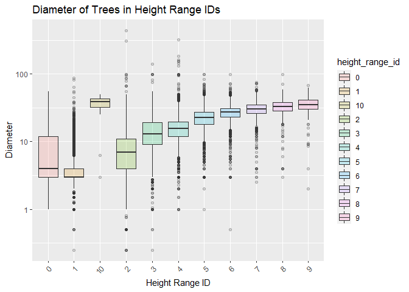
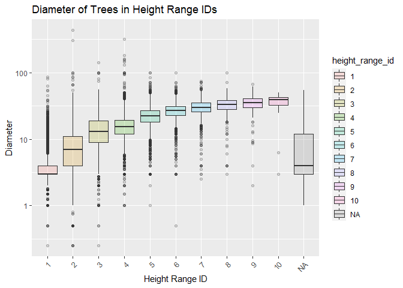
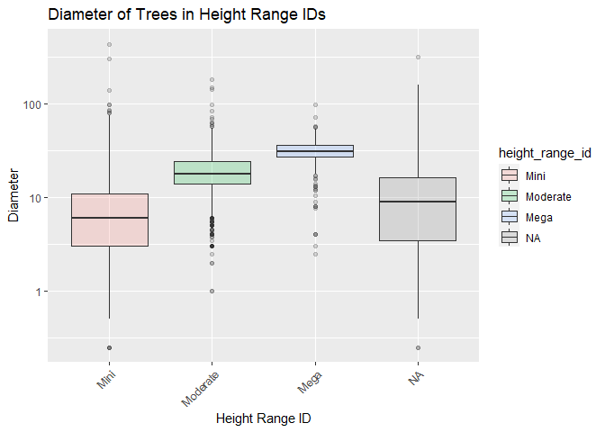

MiniDataAnalysis2
================
Mohammad Ghodsi
2022-10-27

*To complete this milestone, you can edit [this `.rmd`
file](https://raw.githubusercontent.com/UBC-STAT/stat545.stat.ubc.ca/master/content/mini-project/mini-project-2.Rmd)
directly. Fill in the sections that are commented out with
`<!--- start your work here--->`. When you are done, make sure to knit
to an `.md` file by changing the output in the YAML header to
`github_document`, before submitting a tagged release on canvas.*

# Welcome to your second (and last) milestone in your mini data analysis project!

In Milestone 1, you explored your data, came up with research questions,
and obtained some results by making summary tables and graphs. This
time, we will first explore more in depth the concept of *tidy data.*
Then, you’ll be sharpening some of the results you obtained from your
previous milestone by:

- Manipulating special data types in R: factors and/or dates and times.
- Fitting a model object to your data, and extract a result.
- Reading and writing data as separate files.

**NOTE**: The main purpose of the mini data analysis is to integrate
what you learn in class in an analysis. Although each milestone provides
a framework for you to conduct your analysis, it’s possible that you
might find the instructions too rigid for your data set. If this is the
case, you may deviate from the instructions – just make sure you’re
demonstrating a wide range of tools and techniques taught in this class.

# Instructions

**To complete this milestone**, edit [this very `.Rmd`
file](https://raw.githubusercontent.com/UBC-STAT/stat545.stat.ubc.ca/master/content/mini-project/mini-project-2.Rmd)
directly. Fill in the sections that are tagged with
`<!--- start your work here--->`.

**To submit this milestone**, make sure to knit this `.Rmd` file to an
`.md` file by changing the YAML output settings from
`output: html_document` to `output: github_document`. Commit and push
all of your work to your mini-analysis GitHub repository, and tag a
release on GitHub. Then, submit a link to your tagged release on canvas.

**Points**: This milestone is worth 55 points (compared to the 45 points
of the Milestone 1): 45 for your analysis, and 10 for your entire
mini-analysis GitHub repository. Details follow.

**Research Questions**: In Milestone 1, you chose two research questions
to focus on. Wherever realistic, your work in this milestone should
relate to these research questions whenever we ask for justification
behind your work. In the case that some tasks in this milestone don’t
align well with one of your research questions, feel free to discuss
your results in the context of a different research question.

# Learning Objectives

By the end of this milestone, you should:

- Understand what *tidy* data is, and how to create it using `tidyr`.
- Generate a reproducible and clear report using R Markdown.
- Manipulating special data types in R: factors and/or dates and times.
- Fitting a model object to your data, and extract a result.
- Reading and writing data as separate files.

# Setup

Begin by loading your data and the tidyverse package below:

``` r
library(datateachr) # <- might contain the data you picked!
library(tidyverse)
```

    ## Warning: package 'tidyverse' was built under R version 4.1.3

    ## Warning: package 'ggplot2' was built under R version 4.1.3

    ## Warning: package 'tibble' was built under R version 4.1.3

    ## Warning: package 'tidyr' was built under R version 4.1.3

    ## Warning: package 'readr' was built under R version 4.1.3

    ## Warning: package 'purrr' was built under R version 4.1.3

    ## Warning: package 'dplyr' was built under R version 4.1.3

    ## Warning: package 'stringr' was built under R version 4.1.3

    ## Warning: package 'forcats' was built under R version 4.1.3

# Task 1: Tidy your data (15 points)

In this task, we will do several exercises to reshape our data. The goal
here is to understand how to do this reshaping with the `tidyr` package.

A reminder of the definition of *tidy* data:

- Each row is an **observation**
- Each column is a **variable**
- Each cell is a **value**

*Tidy’ing* data is sometimes necessary because it can simplify
computation. Other times it can be nice to organize data so that it can
be easier to understand when read manually.

### 2.1 (2.5 points)

Based on the definition above, can you identify if your data is tidy or
untidy? Go through all your columns, or if you have \>8 variables, just
pick 8, and explain whether the data is untidy or tidy.

<!--------------------------- Start your work below --------------------------->

The database that I am working on is “vancouver_trees”. With regards to
the observations of trees in the individual trees in the dataset, the
data is tidy. Here I will explore 8 columns for tidy-ness.  

tree_id: This column represents the variable of identity number of trees
in the table, and it contains (in this case unique) value of
observations of these id numbers all within the confines of this
column.  

genus_name, species_name, and cultivar_name: These columns represent
their individual variables in accordance to their name (genus, species,
and cultivar). Even though they all pertain to the kind of the tree,
however, they all contain values with distanced observations in regards
to each tree.  

assigned, and root_barrier: These columns represent their individual
boolean variables in accordance to their name (whether the trees are
assigned, and root barrier). They both contain values with distanced
observations in regards to each tree.  

on_street, and neighbourhood_name: These columns represent their
individual variables in accordance to their name (street name, and
neighbourhood name). Even though they both pertain to the the location
of the tree, however, they both contain values with distanced
observations in regards to each tree.  

<!----------------------------------------------------------------------------->

### 2.2 (5 points)

Now, if your data is tidy, untidy it! Then, tidy it back to it’s
original state.

If your data is untidy, then tidy it! Then, untidy it back to it’s
original state.

Be sure to explain your reasoning for this task. Show us the “before”
and “after”.

<!--------------------------- Start your work below --------------------------->

Before undying:

``` r
#here's a glimpse of the tidy data from vancouver_trees dataset
glimpse(vancouver_trees)
```

    ## Rows: 146,611
    ## Columns: 20
    ## $ tree_id            <dbl> 149556, 149563, 149579, 149590, 149604, 149616, 149~
    ## $ civic_number       <dbl> 494, 450, 4994, 858, 5032, 585, 4909, 4925, 4969, 7~
    ## $ std_street         <chr> "W 58TH AV", "W 58TH AV", "WINDSOR ST", "E 39TH AV"~
    ## $ genus_name         <chr> "ULMUS", "ZELKOVA", "STYRAX", "FRAXINUS", "ACER", "~
    ## $ species_name       <chr> "AMERICANA", "SERRATA", "JAPONICA", "AMERICANA", "C~
    ## $ cultivar_name      <chr> "BRANDON", NA, NA, "AUTUMN APPLAUSE", NA, "CHANTICL~
    ## $ common_name        <chr> "BRANDON ELM", "JAPANESE ZELKOVA", "JAPANESE SNOWBE~
    ## $ assigned           <chr> "N", "N", "N", "Y", "N", "N", "N", "N", "N", "N", "~
    ## $ root_barrier       <chr> "N", "N", "N", "N", "N", "N", "N", "N", "N", "N", "~
    ## $ plant_area         <chr> "N", "N", "4", "4", "4", "B", "6", "6", "3", "3", "~
    ## $ on_street_block    <dbl> 400, 400, 4900, 800, 5000, 500, 4900, 4900, 4900, 7~
    ## $ on_street          <chr> "W 58TH AV", "W 58TH AV", "WINDSOR ST", "E 39TH AV"~
    ## $ neighbourhood_name <chr> "MARPOLE", "MARPOLE", "KENSINGTON-CEDAR COTTAGE", "~
    ## $ street_side_name   <chr> "EVEN", "EVEN", "EVEN", "EVEN", "EVEN", "ODD", "ODD~
    ## $ height_range_id    <dbl> 2, 4, 3, 4, 2, 2, 3, 3, 2, 2, 2, 5, 3, 2, 2, 2, 2, ~
    ## $ diameter           <dbl> 10.00, 10.00, 4.00, 18.00, 9.00, 5.00, 15.00, 14.00~
    ## $ curb               <chr> "N", "N", "Y", "Y", "Y", "Y", "Y", "Y", "Y", "Y", "~
    ## $ date_planted       <date> 1999-01-13, 1996-05-31, 1993-11-22, 1996-04-29, 19~
    ## $ longitude          <dbl> -123.1161, -123.1147, -123.0846, -123.0870, -123.08~
    ## $ latitude           <dbl> 49.21776, 49.21776, 49.23938, 49.23469, 49.23894, 4~

After Untyding:

``` r
#To untidy this tidy data, I have used the pivot_wider function to split the root_barrier column into 2 columns, each stating information about the root barrier, but one with the ones with barrier, and the other with the ones without the barrier. This makes the root barrier data to appear in 2 columns.

glimpse(untidy <- vancouver_trees %>% 
  pivot_wider(names_from = root_barrier , names_prefix = "Root_Barrier.", values_from = root_barrier))
```

    ## Rows: 146,611
    ## Columns: 21
    ## $ tree_id            <dbl> 149556, 149563, 149579, 149590, 149604, 149616, 149~
    ## $ civic_number       <dbl> 494, 450, 4994, 858, 5032, 585, 4909, 4925, 4969, 7~
    ## $ std_street         <chr> "W 58TH AV", "W 58TH AV", "WINDSOR ST", "E 39TH AV"~
    ## $ genus_name         <chr> "ULMUS", "ZELKOVA", "STYRAX", "FRAXINUS", "ACER", "~
    ## $ species_name       <chr> "AMERICANA", "SERRATA", "JAPONICA", "AMERICANA", "C~
    ## $ cultivar_name      <chr> "BRANDON", NA, NA, "AUTUMN APPLAUSE", NA, "CHANTICL~
    ## $ common_name        <chr> "BRANDON ELM", "JAPANESE ZELKOVA", "JAPANESE SNOWBE~
    ## $ assigned           <chr> "N", "N", "N", "Y", "N", "N", "N", "N", "N", "N", "~
    ## $ plant_area         <chr> "N", "N", "4", "4", "4", "B", "6", "6", "3", "3", "~
    ## $ on_street_block    <dbl> 400, 400, 4900, 800, 5000, 500, 4900, 4900, 4900, 7~
    ## $ on_street          <chr> "W 58TH AV", "W 58TH AV", "WINDSOR ST", "E 39TH AV"~
    ## $ neighbourhood_name <chr> "MARPOLE", "MARPOLE", "KENSINGTON-CEDAR COTTAGE", "~
    ## $ street_side_name   <chr> "EVEN", "EVEN", "EVEN", "EVEN", "EVEN", "ODD", "ODD~
    ## $ height_range_id    <dbl> 2, 4, 3, 4, 2, 2, 3, 3, 2, 2, 2, 5, 3, 2, 2, 2, 2, ~
    ## $ diameter           <dbl> 10.00, 10.00, 4.00, 18.00, 9.00, 5.00, 15.00, 14.00~
    ## $ curb               <chr> "N", "N", "Y", "Y", "Y", "Y", "Y", "Y", "Y", "Y", "~
    ## $ date_planted       <date> 1999-01-13, 1996-05-31, 1993-11-22, 1996-04-29, 19~
    ## $ longitude          <dbl> -123.1161, -123.1147, -123.0846, -123.0870, -123.08~
    ## $ latitude           <dbl> 49.21776, 49.21776, 49.23938, 49.23469, 49.23894, 4~
    ## $ Root_Barrier.N     <chr> "N", "N", "N", "N", "N", "N", "N", "N", "N", "N", "~
    ## $ Root_Barrier.Y     <chr> NA, NA, NA, NA, NA, NA, NA, NA, NA, NA, NA, NA, NA,~

After tidying back up:

``` r
# untidy data is re-tidy-ed so that there is only one column with the variables pertaining to root_barrier

glimpse(tidy_ed <- untidy %>% 
 pivot_longer(cols = starts_with("root_barrier"), names_to = "naam", values_to = "Root_Barrier" ) %>% 
   select(!"naam") %>% 
   distinct(tree_id, .keep_all = TRUE))
```

    ## Rows: 146,611
    ## Columns: 20
    ## $ tree_id            <dbl> 149556, 149563, 149579, 149590, 149604, 149616, 149~
    ## $ civic_number       <dbl> 494, 450, 4994, 858, 5032, 585, 4909, 4925, 4969, 7~
    ## $ std_street         <chr> "W 58TH AV", "W 58TH AV", "WINDSOR ST", "E 39TH AV"~
    ## $ genus_name         <chr> "ULMUS", "ZELKOVA", "STYRAX", "FRAXINUS", "ACER", "~
    ## $ species_name       <chr> "AMERICANA", "SERRATA", "JAPONICA", "AMERICANA", "C~
    ## $ cultivar_name      <chr> "BRANDON", NA, NA, "AUTUMN APPLAUSE", NA, "CHANTICL~
    ## $ common_name        <chr> "BRANDON ELM", "JAPANESE ZELKOVA", "JAPANESE SNOWBE~
    ## $ assigned           <chr> "N", "N", "N", "Y", "N", "N", "N", "N", "N", "N", "~
    ## $ plant_area         <chr> "N", "N", "4", "4", "4", "B", "6", "6", "3", "3", "~
    ## $ on_street_block    <dbl> 400, 400, 4900, 800, 5000, 500, 4900, 4900, 4900, 7~
    ## $ on_street          <chr> "W 58TH AV", "W 58TH AV", "WINDSOR ST", "E 39TH AV"~
    ## $ neighbourhood_name <chr> "MARPOLE", "MARPOLE", "KENSINGTON-CEDAR COTTAGE", "~
    ## $ street_side_name   <chr> "EVEN", "EVEN", "EVEN", "EVEN", "EVEN", "ODD", "ODD~
    ## $ height_range_id    <dbl> 2, 4, 3, 4, 2, 2, 3, 3, 2, 2, 2, 5, 3, 2, 2, 2, 2, ~
    ## $ diameter           <dbl> 10.00, 10.00, 4.00, 18.00, 9.00, 5.00, 15.00, 14.00~
    ## $ curb               <chr> "N", "N", "Y", "Y", "Y", "Y", "Y", "Y", "Y", "Y", "~
    ## $ date_planted       <date> 1999-01-13, 1996-05-31, 1993-11-22, 1996-04-29, 19~
    ## $ longitude          <dbl> -123.1161, -123.1147, -123.0846, -123.0870, -123.08~
    ## $ latitude           <dbl> 49.21776, 49.21776, 49.23938, 49.23469, 49.23894, 4~
    ## $ Root_Barrier       <chr> "N", "N", "N", "N", "N", "N", "N", "N", "N", "N", "~

<!----------------------------------------------------------------------------->

### 2.3 (7.5 points)

Now, you should be more familiar with your data, and also have made
progress in answering your research questions. Based on your interest,
and your analyses, pick 2 of the 4 research questions to continue your
analysis in the next four tasks:

<!-------------------------- Start your work below ---------------------------->

1.  *Is there a correlation between the diameter of trees and the height
    range ID*
2.  *Is there a correlation between the age and diameter of a tree, and
    would having a root barrier effect this correlation?*

<!----------------------------------------------------------------------------->

Explain your decision for choosing the above two research questions.

<!--------------------------- Start your work below --------------------------->

These two questions are chosen because 1)they have a straight forward
objective, 2) they are correlated, as in they serve the theme of
measuring the growth of the trees, 3) the dataset’s tidyness serve them
best.
<!----------------------------------------------------------------------------->

Now, try to choose a version of your data that you think will be
appropriate to answer these 2 questions. Use between 4 and 8 functions
that we’ve covered so far (i.e. by filtering, cleaning, tidy’ing,
dropping irrelevant columns, etc.).

<!--------------------------- Start your work below --------------------------->

In order to examine the correlation between the diameter, age, and root
barrier, and height id, I first need to calculate the age of trees from
their planting date. To do this, I have first separated the date_planted
into its “year”, “month”, “day” component using the separate function.
Then in order to calculate the relative age of the trees, I used the
arrange function to have the youngest trees at the top of the table, and
used mutate function to minus the other trees’ year from that youngest
tree’s year (+1 to have the age start at 1 year old). Then I used select
function to only keep the columns that I am going to us for my analysis.
I also changed the type of height_id to character for ease of
calculation.

``` r
(tree_age_barrier <- vancouver_trees %>%
   mutate(across(height_range_id, as.character)) %>% 
  separate(date_planted, into = c("year" , "month", "day"), "-", convert = T) %>%  
   arrange(desc(year)) %>%
   mutate(age= first(year)-year+1) %>% 
   select(tree_id, diameter, age, root_barrier,   height_range_id))
```

    ## # A tibble: 146,611 x 5
    ##    tree_id diameter   age root_barrier height_range_id
    ##      <dbl>    <dbl> <dbl> <chr>        <chr>          
    ##  1  162563        3     1 N            1              
    ##  2  163039        3     1 Y            1              
    ##  3  163211        3     1 Y            1              
    ##  4  245629        3     1 N            1              
    ##  5  245770        3     1 N            1              
    ##  6  245882        3     1 N            1              
    ##  7  245958        3     1 N            1              
    ##  8  246038        3     1 N            1              
    ##  9  246531        3     1 N            1              
    ## 10  248345        3     1 Y            1              
    ## # ... with 146,601 more rows

<!----------------------------------------------------------------------------->

# Task 2: Special Data Types (10)

For this exercise, you’ll be choosing two of the three tasks below –
both tasks that you choose are worth 5 points each.

But first, tasks 1 and 2 below ask you to modify a plot you made in a
previous milestone. The plot you choose should involve plotting across
at least three groups (whether by facetting, or using an aesthetic like
colour). Place this plot below (you’re allowed to modify the plot if
you’d like). If you don’t have such a plot, you’ll need to make one.
Place the code for your plot below.

<!-------------------------- Start your work below ---------------------------->

``` r
(tree_age_barrier %>% 
ggplot(aes(x=height_range_id, y=diameter, fill=height_range_id)) +
    geom_boxplot(alpha=0.2) +
    scale_y_log10()+
    labs(x='Height Range ID', y="Diameter", 
         title='Diameter of Trees in Height Range IDs') +
  theme(axis.text.x = element_text(angle = 45, hjust = 1)))
```

    ## Warning: Transformation introduced infinite values in continuous y-axis

    ## Warning: Removed 92 rows containing non-finite values (stat_boxplot).

<!-- -->

<!----------------------------------------------------------------------------->

Now, choose two of the following tasks.

1.  Produce a new plot that reorders a factor in your original plot,
    using the `forcats` package (3 points). Then, in a sentence or two,
    briefly explain why you chose this ordering (1 point here for
    demonstrating understanding of the reordering, and 1 point for
    demonstrating some justification for the reordering, which could be
    subtle or speculative.)

2.  Produce a new plot that groups some factor levels together into an
    “other” category (or something similar), using the `forcats` package
    (3 points). Then, in a sentence or two, briefly explain why you
    chose this grouping (1 point here for demonstrating understanding of
    the grouping, and 1 point for demonstrating some justification for
    the grouping, which could be subtle or speculative.)

3.  If your data has some sort of time-based column like a date (but
    something more granular than just a year):

    1.  Make a new column that uses a function from the `lubridate` or
        `tsibble` package to modify your original time-based column. (3
        points)

        - Note that you might first have to *make* a time-based column
          using a function like `ymd()`, but this doesn’t count.
        - Examples of something you might do here: extract the day of
          the year from a date, or extract the weekday, or let 24 hours
          elapse on your dates.

    2.  Then, in a sentence or two, explain how your new column might be
        useful in exploring a research question. (1 point for
        demonstrating understanding of the function you used, and 1
        point for your justification, which could be subtle or
        speculative).

        - For example, you could say something like “Investigating the
          day of the week might be insightful because penguins don’t
          work on weekends, and so may respond differently”.

<!-------------------------- Start your work below ---------------------------->

**Task Number**: Task 1

The height_range_id is in a character form, and the plot represents it
in alphabetical order. Here, I have changed it into factor for in order
to arrange the groups and have the numbers show up in increasing order.

``` r
fact1_trees_height <- tree_age_barrier %>%
  mutate(height_range_id = factor(case_when(height_range_id== "1" ~ "1", height_range_id== "2" ~ "2", height_range_id == "3" ~ "3", height_range_id == "4" ~ "4", height_range_id == "5" ~ "5", height_range_id == "6" ~ "6", height_range_id == "7" ~ "7", height_range_id == "8" ~ "8", height_range_id == "9" ~ "9", height_range_id == "10" ~ "10"), levels = c("1", "2", "3", "4", "5", "6", "7", "8", "9", "10")))

(fact1_trees_height %>% 
ggplot(aes(x=height_range_id, y=diameter, fill=height_range_id)) +
    geom_boxplot(alpha=0.2) +
    scale_y_log10()+
    labs(x='Height Range ID', y="Diameter", 
         title='Diameter of Trees in Height Range IDs') +
  theme(axis.text.x = element_text(angle = 45, hjust = 1)))
```

    ## Warning: Transformation introduced infinite values in continuous y-axis

    ## Warning: Removed 92 rows containing non-finite values (stat_boxplot).

<!-- -->

<!----------------------------------------------------------------------------->
<!-------------------------- Start your work below ---------------------------->

**Task Number**: Task 2 This new grouping of factors places the
height_range_id values in a more descriptive and easier to interpolate
groups, corresponding to mini for the smaller range (1, 2, 3), moderate
for the medium sized rage (4, 5, 6), and mega for the bigger length
range (7, 8, 9, 10).

``` r
(fact2_trees_height <- fact1_trees_height %>%
  mutate(height_range_id = factor(case_when(height_range_id == c("1", "2", "3") ~ "Mini", height_range_id == c("4", "5", "6") ~ "Moderate", height_range_id == c("7", "8", "9", "10") ~ "Mega"), levels = c("Mini", "Moderate", "Mega"))))
```

    ## Warning in `==.default`(height_range_id, c("1", "2", "3")): longer object length
    ## is not a multiple of shorter object length

    ## Warning in is.na(e1) | is.na(e2): longer object length is not a multiple of
    ## shorter object length

    ## Warning in `==.default`(height_range_id, c("4", "5", "6")): longer object length
    ## is not a multiple of shorter object length

    ## Warning in is.na(e1) | is.na(e2): longer object length is not a multiple of
    ## shorter object length

    ## Warning in `==.default`(height_range_id, c("7", "8", "9", "10")): longer object
    ## length is not a multiple of shorter object length

    ## Warning in is.na(e1) | is.na(e2): longer object length is not a multiple of
    ## shorter object length

    ## # A tibble: 146,611 x 5
    ##    tree_id diameter   age root_barrier height_range_id
    ##      <dbl>    <dbl> <dbl> <chr>        <fct>          
    ##  1  162563        3     1 N            Mini           
    ##  2  163039        3     1 Y            <NA>           
    ##  3  163211        3     1 Y            <NA>           
    ##  4  245629        3     1 N            Mini           
    ##  5  245770        3     1 N            <NA>           
    ##  6  245882        3     1 N            <NA>           
    ##  7  245958        3     1 N            Mini           
    ##  8  246038        3     1 N            <NA>           
    ##  9  246531        3     1 N            <NA>           
    ## 10  248345        3     1 Y            Mini           
    ## # ... with 146,601 more rows

``` r
(fact2_trees_height %>% 
ggplot(aes(x=height_range_id, y=diameter, fill=height_range_id)) +
    geom_boxplot(alpha=0.2) +
    scale_y_log10()+
    labs(x='Height Range ID', y="Diameter", 
         title='Diameter of Trees in Height Range IDs') +
  theme(axis.text.x = element_text(angle = 45, hjust = 1)))
```

    ## Warning: Transformation introduced infinite values in continuous y-axis

    ## Warning: Removed 92 rows containing non-finite values (stat_boxplot).

<!-- -->

<!----------------------------------------------------------------------------->

# Task 3: Modelling

## 2.0 (no points)

Pick a research question, and pick a variable of interest (we’ll call it
“Y”) that’s relevant to the research question. Indicate these.

<!-------------------------- Start your work below ---------------------------->

**Research Question**: Is there a correlation between the age and
diameter of a tree?

**Variable of interest**: age

<!----------------------------------------------------------------------------->

## 2.1 (5 points)

Fit a model or run a hypothesis test that provides insight on this
variable with respect to the research question. Store the model object
as a variable, and print its output to screen. We’ll omit having to
justify your choice, because we don’t expect you to know about model
specifics in STAT 545.

- **Note**: It’s OK if you don’t know how these models/tests work. Here
  are some examples of things you can do here, but the sky’s the limit.

  - You could fit a model that makes predictions on Y using another
    variable, by using the `lm()` function.
  - You could test whether the mean of Y equals 0 using `t.test()`, or
    maybe the mean across two groups are different using `t.test()`, or
    maybe the mean across multiple groups are different using `anova()`
    (you may have to pivot your data for the latter two).
  - You could use `lm()` to test for significance of regression.

<!-------------------------- Start your work below ---------------------------->

Here I am fitting a model that makes predictions on age using diameter,
by using the lm() function

``` r
mu_lm <- lm(age ~ diameter, tree_age_barrier)
print(mu_lm)
```

    ## 
    ## Call:
    ## lm(formula = age ~ diameter, data = tree_age_barrier)
    ## 
    ## Coefficients:
    ## (Intercept)     diameter  
    ##     12.3272       0.6682

<!----------------------------------------------------------------------------->

## 2.2 (5 points)

Produce something relevant from your fitted model: either predictions on
Y, or a single value like a regression coefficient or a p-value.

- Be sure to indicate in writing what you chose to produce.
- Your code should either output a tibble (in which case you should
  indicate the column that contains the thing you’re looking for), or
  the thing you’re looking for itself.
- Obtain your results using the `broom` package if possible. If your
  model is not compatible with the broom function you’re needing, then
  you can obtain your results by some other means, but first indicate
  which broom function is not compatible.

<!-------------------------- Start your work below ---------------------------->

Here, I am using the model from the previous part to predict the
diameter when age is 13 to 20. It fits out 8 predictions for diameters,
corresponding to ages 13 to 20.

``` r
library (broom)
```

    ## Warning: package 'broom' was built under R version 4.1.3

``` r
(predict (mu_lm, newdata = tibble(diameter = 13:20)))
```

    ##        1        2        3        4        5        6        7        8 
    ## 21.01339 21.68156 22.34972 23.01789 23.68605 24.35422 25.02238 25.69055

<!----------------------------------------------------------------------------->

# Task 4: Reading and writing data

Get set up for this exercise by making a folder called `output` in the
top level of your project folder / repository. You’ll be saving things
there.

## 3.1 (5 points)

Take a summary table that you made from Milestone 1 (Task 4.2), and
write it as a csv file in your `output` folder. Use the `here::here()`
function.

- **Robustness criteria**: You should be able to move your Mini Project
  repository / project folder to some other location on your computer,
  or move this very Rmd file to another location within your project
  repository / folder, and your code should still work.
- **Reproducibility criteria**: You should be able to delete the csv
  file, and remake it simply by knitting this Rmd file.

<!-------------------------- Start your work below ---------------------------->

Summary tibble from Milestone 1:

``` r
(diameter_stat <- vancouver_trees %>% 
  group_by(height_range_id) %>% 
  summarise(mean_diameter = mean(diameter, na.rm=T),
         diameter_range = (max(diameter)-min(diameter)),
         diameter_standard_dev = sd(diameter, na.rm=T),
         diameter_CV = (sd(diameter, na.rm=T)/mean(diameter, na.rm=T)*100),
         number_of_samples = n()))
```

    ## # A tibble: 11 x 6
    ##    height_range_id mean_diameter diameter_range diameter_stand~1 diame~2 numbe~3
    ##              <dbl>         <dbl>          <dbl>            <dbl>   <dbl>   <int>
    ##  1               0          5.41           55               8.11   150.      214
    ##  2               1          3.92           86               2.28    58.2   39959
    ##  3               2          8.38          435               5.99    71.5   42206
    ##  4               3         14.6           141               7.60    51.9   26307
    ##  5               4         16.6           316               7.03    42.5   20530
    ##  6               5         22.8            98               7.16    31.4    9014
    ##  7               6         27.3            99               7.11    26.1    5195
    ##  8               7         30.8            72.5             7.46    24.2    2225
    ##  9               8         33.3            96               8.27    24.9     746
    ## 10               9         34.8            65               9.69    27.9     203
    ## 11              10         34.1            47              15.3     44.7      12
    ## # ... with abbreviated variable names 1: diameter_standard_dev, 2: diameter_CV,
    ## #   3: number_of_samples

This code Creates a CSV file of the above tibble in the “output” folder
on the project directory using here() function

``` r
library(here)
```

    ## Warning: package 'here' was built under R version 4.1.3

    ## here() starts at C:/Users/Mohammed Ghodsi/Desktop/Grad school/Fall 2022/Stat545A/Mini_Data_Analysis_Mohammad_Ghodsi

``` r
write_csv(diameter_stat, here("output", "Summary_Tibble_MilStn1_DmtrSt.csv"))
```

<!----------------------------------------------------------------------------->

## 3.2 (5 points)

Write your model object from Task 3 to an R binary file (an RDS), and
load it again. Be sure to save the binary file in your `output` folder.
Use the functions `saveRDS()` and `readRDS()`.

- The same robustness and reproducibility criteria as in 3.1 apply here.

<!-------------------------- Start your work below ---------------------------->

``` r
#this code saves the summary tibble as R binary file on "output" folder on the project directory
saveRDS(diameter_stat, here("output", "Summary_Tibble_MilStn1_DmtrSt.rds"))

#this code reads the R binary file on "output" folder on the project directory
(readRDS(here("output", "Summary_Tibble_MilStn1_DmtrSt.rds")))
```

    ## # A tibble: 11 x 6
    ##    height_range_id mean_diameter diameter_range diameter_stand~1 diame~2 numbe~3
    ##              <dbl>         <dbl>          <dbl>            <dbl>   <dbl>   <int>
    ##  1               0          5.41           55               8.11   150.      214
    ##  2               1          3.92           86               2.28    58.2   39959
    ##  3               2          8.38          435               5.99    71.5   42206
    ##  4               3         14.6           141               7.60    51.9   26307
    ##  5               4         16.6           316               7.03    42.5   20530
    ##  6               5         22.8            98               7.16    31.4    9014
    ##  7               6         27.3            99               7.11    26.1    5195
    ##  8               7         30.8            72.5             7.46    24.2    2225
    ##  9               8         33.3            96               8.27    24.9     746
    ## 10               9         34.8            65               9.69    27.9     203
    ## 11              10         34.1            47              15.3     44.7      12
    ## # ... with abbreviated variable names 1: diameter_standard_dev, 2: diameter_CV,
    ## #   3: number_of_samples

<!----------------------------------------------------------------------------->

# Tidy Repository

Now that this is your last milestone, your entire project repository
should be organized. Here are the criteria we’re looking for.

## Main README (3 points)

There should be a file named `README.md` at the top level of your
repository. Its contents should automatically appear when you visit the
repository on GitHub.

Minimum contents of the README file:

- In a sentence or two, explains what this repository is, so that
  future-you or someone else stumbling on your repository can be
  oriented to the repository.
- In a sentence or two (or more??), briefly explains how to engage with
  the repository. You can assume the person reading knows the material
  from STAT 545A. Basically, if a visitor to your repository wants to
  explore your project, what should they know?

Once you get in the habit of making README files, and seeing more README
files in other projects, you’ll wonder how you ever got by without them!
They are tremendously helpful.

## File and Folder structure (3 points)

You should have at least three folders in the top level of your
repository: one for each milestone, and one output folder. If there are
any other folders, these are explained in the main README.

Each milestone document is contained in its respective folder, and
nowhere else.

Every level-1 folder (that is, the ones stored in the top level, like
“Milestone1” and “output”) has a `README` file, explaining in a sentence
or two what is in the folder, in plain language (it’s enough to say
something like “This folder contains the source for Milestone 1”).

## Output (2 points)

All output is recent and relevant:

- All Rmd files have been `knit`ted to their output, and all data files
  saved from Task 4 above appear in the `output` folder.
- All of these output files are up-to-date – that is, they haven’t
  fallen behind after the source (Rmd) files have been updated.
- There should be no relic output files. For example, if you were
  knitting an Rmd to html, but then changed the output to be only a
  markdown file, then the html file is a relic and should be deleted.

Our recommendation: delete all output files, and re-knit each
milestone’s Rmd file, so that everything is up to date and relevant.

PS: there’s a way where you can run all project code using a single
command, instead of clicking “knit” three times. More on this in STAT
545B!

## Error-free code (1 point)

This Milestone 1 document knits error-free, and the Milestone 2 document
knits error-free.

Plots failing to show up on Github in the .md counts as an error here.
So does the entire .md failing to show up on Github in the .md (“Sorry
about that, but we can’t show files that are this big right now”).

## Tagged release (1 point)

You’ve tagged a release for Milestone 1, and you’ve tagged a release for
Milestone 2.

### Attribution

Thanks to Victor Yuan for mostly putting this together.
